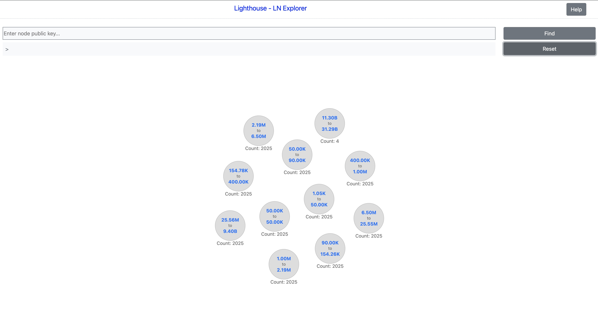
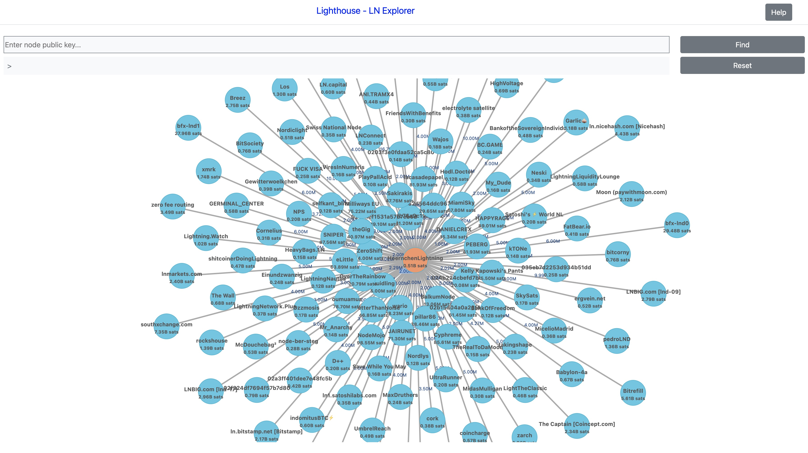
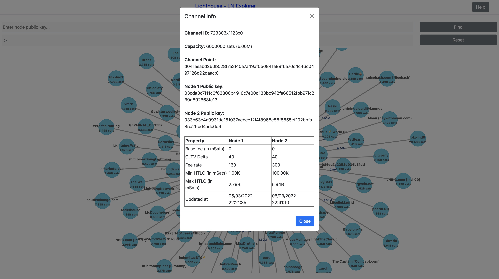
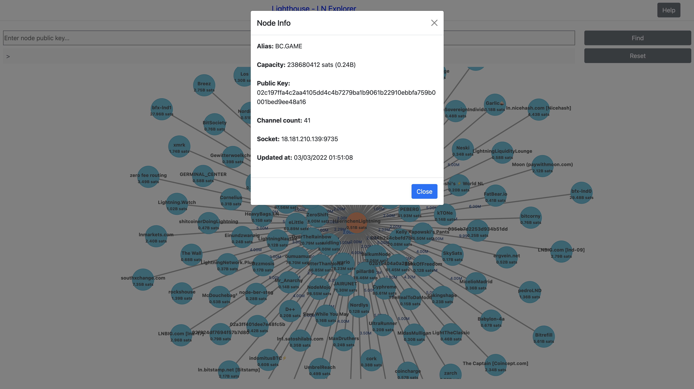

# lighthouse
A Lightnig Network Explorer backend.






For demo, visit https://lnlighthouse.online (Tested only in Chrome & Firefox and Desktop is preferred to view)

For frontend, visit https://github.com/saravanan7mani/lighthouse-web
## Built with

NodeJS v16.14.0

Express v4.16.1

Neo4J v4.4.3

LND v0.14.2-beta

## Neo4j
### Enable APOC library
https://neo4j.com/labs/apoc/4.1/installation/

### Schema
CREATE CONSTRAINT node_public_key_unique IF NOT EXISTS FOR (n:Node) REQUIRE n.public_key IS UNIQUE

CREATE CONSTRAINT channel_channel_id_unique IF NOT EXISTS FOR (c:Channel) REQUIRE c.channel_id IS UNIQUE

CREATE INDEX FOR (n:Node) ON (n.alias)

CREATE INDEX FOR (n:Node) ON (n.capacity)

CREATE INDEX FOR (n:Node) ON (n.channel_count)

CREATE INDEX FOR (c:Channel) ON (c.capacity)


## Environment variables
process.env.PORT

process.env.NEO4J_URI

process.env.NEO4J_USERNAME

process.env.NEO4J_PASSWORD

process.env.LND_URI

process.env.LND_CERT - base64

process.env.LND_MACAROON - base64


## API
### 1. Get nodes by total capacity size.

#### Request:
GET /graph/nodes

##### Query params:

min_capacity - capacity in sats

max_capacity - capacity in sats

skip - no. of nodes to skip

limit - no. of nodes to return


#### Sample response:
```json
{
    "nodes_count":2,
    "nodes":[{
        "alias":"A name for your node",
        "capacity":20000,
        "channel_count":1,
        "public_key":"221b9196e8b0ccd1c13b4880112d2222c9c2132879f5e6b16f17ffaeb84fb064a2",
        "sockets":["127.0.0.1:9735"],
        "updated_at":"2021-11-23T01:01:43.000Z"
    },
    {   
        "capacity":30000,
        "channel_count":5,
        "public_key":"644b9196e8b0ccd1c13b4880112d2222c9c2132879f5e6b16f17ffaeb84fb064a7",
    }]
}
```
### 2. Get nodes, their peer nodes and channels by public keys

#### Request:
POST /graph/nodes

##### body json:

{"public_keys": [public keys]}

#### Sample response:
```json
{
    "nodes": [
        {
            "public_key": "0374c403a1f2733ae30d466c9e1c1a15e10bab46cb1b17cb4d3ec6db618c92545b",
            "alias": "KomodoAtomicDEX                 ",
            "capacity": 60000,
            "channel_count": 3,
            "updated_at": "2022-01-28T21:09:54.000Z",
            "color": "#000000",
            "sockets": [
                "156.215.92.63:9735"
            ]
        },
        {
            "public_key": "0200a7f20e51049363cb7f2a0865fe072464d469dca0ac34c954bb3d4b552b6e95",
            "alias": "looptest",
            "capacity": 107703641,
            "channel_count": 35,
            "updated_at": "2022-02-16T03:07:06.000Z",
            "color": "#cccccc",
            "sockets": [
                "80.253.94.252:9736"
            ]
        },
    ],
    "nodes_count": 2,
    "channels": [
        {
            "channel_id": "2135616x31x0",
            "n0_public_key": "0374c403a1f2733ae30d466c9e1c1a15e10bab46cb1b17cb4d3ec6db618c92545b",
            "n1_public_key": "0200a7f20e51049363cb7f2a0865fe072464d469dca0ac34c954bb3d4b552b6e95",
            "capacity": 20000,
            "channel_point": "b1d7ca9fee6e711a9ffe04cbb3109afc1646e5d4c74e961588b6bb69a9374e25:0",
            "updated_at": "2022-02-14T18:37:06.000Z",
            "n0_base_fee_mtokens": "1000",
            "n0_cltv_delta": 72,
            "n0_max_htlc_mtokens": "2000000",
            "n0_min_htlc_mtokens": "1",
            "n0_updated_at": "2022-01-17T08:47:51.000Z",
            "n1_base_fee_mtokens": "1000",
            "n1_cltv_delta": 40,
            "n1_fee_rate": 1,
            "n1_is_disabled": true,
            "n1_max_htlc_mtokens": "2000000",
            "n1_min_htlc_mtokens": "1000",
            "n1_updated_at": "2022-02-14T18:37:06.000Z"
        }
    ],
    "channel_count": 1
}
```
